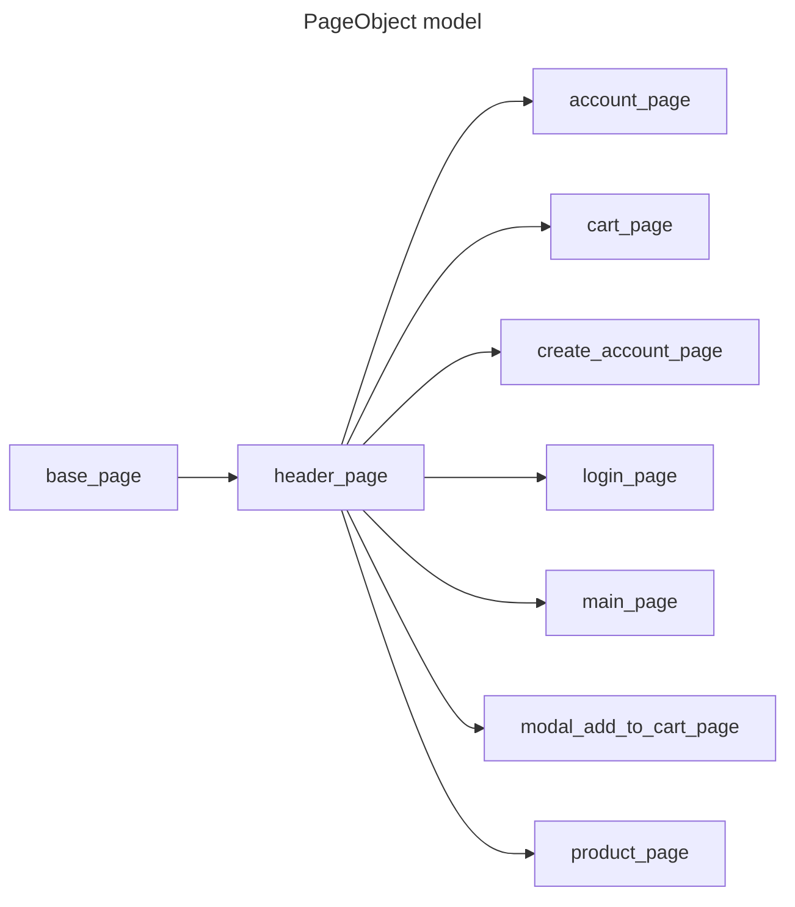

# Проект по автоматизированному тестированию онлайн магазина TestShopQA

___
## Описание

Данный проект предназначен для автоматизации тестирования веб-приложений с использованием библиотеки Selenium 
и языка программирования Python. Тесты помогают обеспечить качество и стабильность 
веб-приложений при внесении изменений в код.\
Ссылка на веб-приложение:\
```http://testshop.qa-practice.com/```

___

## Версии ПО и библиотек

Python 3.11\
[Poetry](https://python-poetry.org/) 2.3.4 — менеджер зависимостей

Основные зависимости (см. `pyproject.toml`, точные версии — в `poetry.lock`):

| Пакет | Версия |
| --- | --- |
| allure-pytest | >= 2.15.0, < 3.0.0 |
| faker | >= 37.6.0, < 38.0.0 |
| pytest | >= 8.4.1, < 9.0.0 |
| pytest-rerunfailures | >= 15.1, < 16.0 |
| pytest-xdist | >= 3.8.0, < 4.0.0 |
| python-dotenv | >= 1.1.1, < 2.0.0 |
| selenium | >= 4.35.0, < 5.0.0 |

___

## Структура проекта

+ :file_folder: **TestShopQA** *- Репозиторий*
  + :file_folder: **config** *- Файлы конфигурации тестов*
  + :file_folder: **data_for_tests** *- Тестовые данные*
  + :file_folder: **elements** *- Методы взаимодействия с элементами страниц*
  + :file_folder: **locators** *- Локаторы на страницах*
  + :file_folder: **pages** *- Методы взаимодействия со страницами веб приложения*
  + :file_folder: **tests** *- Файлы с тестами*
    + :page_facing_up: **test_cart_page** *- Тесты страницы корзины*
    + :page_facing_up: **test_create_account_page** *- Тесты страницы создания аккаунта*
    + :page_facing_up: **test_login_page** *- Тесты страницы авторизации*
    + :page_facing_up: **test_main_page** *- Тесты главной страницы*
    + :page_facing_up: **test_product_page** *- Тесты страницы товара*
  + :page_facing_up: **conftest.py** *- Фикстуры для тестов*
  + :page_facing_up: **pytest.ini** *- Файл конфигурации для библиотеки Pytest*
  + :page_facing_up: **pyproject.toml** *- Описание проекта и зависимости*
  + :page_facing_up: **poetry.lock** *- Зафиксированные версии зависимостей*
  + :page_facing_up: **Dockerfile** *- Образ для запуска тестов в Docker*
  + :page_facing_up: **docker-compose.yml** *- Сценарии запуска тестов и отчёта Allure*
___

### Схема проектирования


```mermaid
---
title: PageObject model
---
graph LR
base_page --> header_page;
header_page --> account_page;
header_page --> cart_page;
header_page --> create_account_page;
header_page --> login_page;
header_page --> main_page;
header_page --> modal_add_to_cart_page;
header_page --> product_page;
```
___

## Установка

1. Склонировать репозиторий\
```git clone https://github.com/shmurge/TestShopQA```
2. Перейти в репозиторий\
```cd TestShopQA```
3. Установить [Poetry](https://python-poetry.org/docs/#installation) (рекомендуется версия 2.3.4)
4. Установить зависимости проекта\
```poetry install```

Зависимости описаны в `pyproject.toml`. Файл `requirements.txt` в проекте не используется.

## Запуск тестов

Перед запуском:
+ создайте в корневой директории файл `.env`
+ запишите туда валидные данные пользователя,
зарегистрированного в приложении TestShopQA в формате:\
`LOGIN='электронная почта'`\
`USERNAME='ФИО'`\
`PASSWORD='пароль пользователя'`

---
Используйте следующие команды (через Poetry):

+ Для запуска в браузере Chrome (по умолчанию):\
```poetry run pytest -v -s --tb=line --reruns=3 --headless --alluredir=allure-results```\
где `reruns` — количество перезапусков теста в случае падения;\
`--headless` — фоновый режим работы браузера (для запуска в обычном режиме уберите параметр `--headless`);\
`--alluredir=allure-results` — создаёт директорию `allure-results` в корне проекта с результатами прогона

+ Для запуска в браузере Firefox:\
```poetry run pytest -v -s --tb=line --reruns=3 --browser=firefox --headless --alluredir=allure-results```

+ Для запуска тестов в несколько потоков:\
```poetry run pytest -v -s --tb=line --reruns=3 -n=auto --headless --alluredir=allure-results```\
где `-n` — количество потоков (`2`, `3`, `5` и т.д.), `auto` — максимально возможное количество потоков

+ Для просмотра отчёта Allure:\
```allure serve allure-results```\
после перейдите в браузер (если редирект не произошёл автоматически);\
перед следующим прогоном рекомендуется очистить директорию `allure-results`

## Запуск в Docker

В образе установлены Python, Poetry, браузеры (Chrome/Chromium и Firefox), Allure и зависимости из `poetry.lock`.

1. Собрать образ (при необходимости):\
```docker compose build```
2. Передать переменные окружения из `.env` (или экспортировать `LOGIN`, `USERNAME`, `PASSWORD`)
3. Запустить тесты в Chrome:\
```docker compose up run_tests_in_chrome```
4. Запустить тесты в Firefox:\
```docker compose up run_tests_in_firefox```
5. Сгенерировать HTML-отчёт Allure:\
```docker compose up report```

При монтировании проекта в контейнер не используйте локальный `.venv` с хоста (он собран под другую ОС). Для локальной разработки удобно хранить виртуальное окружение Poetry вне каталога проекта:\
```poetry config virtualenvs.in-project false```

___
