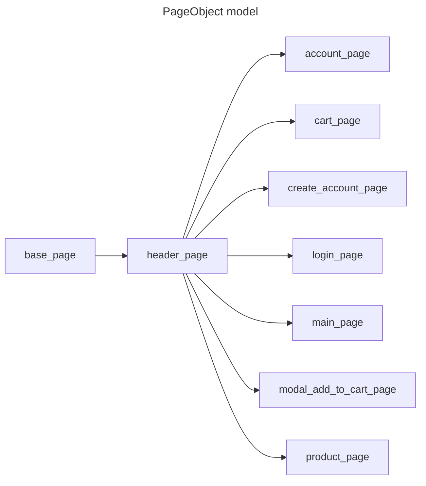

# Проект по автоматизированному тестированию онлайн магазина TestShopQA

___
## Описание

Данный проект предназначен для автоматизации тестирования веб-приложений с использованием библиотеки Selenium 
и языка программирования Python. Тесты помогают обеспечить качество и стабильность 
веб-приложений при внесении изменений в код.\
Ссылка на веб-приложение:\
```http://testshop.qa-practice.com/```

___

## Версии ПО и библиотек

Python 3.11\
allure-pytest 2.15.0\
allure-python-commons 2.15.0\
attrs==25.3.0\
certifi==2025.8.3\
charset-normalizer==3.4.3\
execnet==2.1.1\
Faker==37.6.0\
h11==0.16.0\
idna==3.10\
iniconfig==2.1.0\
outcome==1.3.0.post0\
packaging==25.0\
pluggy==1.6.0\
Pygments==2.19.2\
PySocks==1.7.1\
pytest==8.4.1\
pytest-order==1.3.0\
pytest-rerunfailures==15.1\
pytest-xdist==3.8.0\
python-dotenv==1.1.1\
requests==2.32.5\
selenium==4.35.0\
sniffio==1.3.1\
sortedcontainers==2.4.0\
trio==0.30.0\
trio-websocket==0.12.2\
typing_extensions==4.14.1\
tzdata==2025.2\
urllib3==2.5.0\
websocket-client==1.8.0\
wsproto==1.2.0\
___

## Структура проекта

+ :file_folder: **TestShopQA** *- Репозиторий*
  + :file_folder: **config** *- Файлы конфигурации тестов*
  + :file_folder: **data_for_tests** *- Тестовые данные*
  + :file_folder: **elements** *- Методы взаимодействия с элементами страниц*
  + :file_folder: **locators** *- Локаторы на страницах*
  + :file_folder: **pages** *- Методы взаимодействия со страницами веб приложения*
  + :file_folder: **tests** *- Файлы с тестами*
    + :page_facing_up: **test_cart_page** *- Тесты страницы корзины*
    + :page_facing_up: **test_create_account_page** *- Тесты страницы создания аккаунта*
    + :page_facing_up: **test_login_page** *- Тесты страницы авторизации*
    + :page_facing_up: **test_main_page** *- Тесты главной страницы*
    + :page_facing_up: **test_product_page** *- Тесты страницы товара*
  + :page_facing_up: **conftest** *- Фикстуры для тестов*
  + :page_facing_up: **pytest.ini** *- Файл конфигурации для библиотеки Pytest*
  + :page_facing_up: **requirements.txt** *- Зависимости*
___

### Схема проектирования


___

## Установка

1. Склонировать репозиторий\
```git clone https://github.com/shmurge/TestShopQA```
2. Перейти в репозиторий\
```cd TestShopQA```
3. Установка зависимостей\
```pip install -r requirements.txt```


## Запуск тестов
Перед запуском:
+ создайте в корневой директории файл .env
+ запишите туда валидные данные пользователя,
зарегистрированного в приложении TestShopQA в формате:\
LOGIN='электронная почта'\
USERNAME='ФИО'\
PASSWORD='пароль пользователя'
---
Используйте следующие скрипты\
+ ```cd tests``` для перехода в директорию с тестами
+ Для запуска в браузере chrome (по умолчанию установлен chrome):\
```pytest -v -s --tb=line --reruns=3 --headless --alluredir allure-report```\
где reruns - количество перезапусков теста в случае падения\
--headless фоновый режим работы браузера (для запуска в обычном режиме уберите параметр --headless)
--alluredir allure_report создает директорию allure_report в корне проекта с отчетом по прогону
+ Для запуска в браузере firefox:\
```pytest -v -s --tb=line --reruns=3 --browser=firefox --headless --alluredir allure-report```
+ Для запуска тестов в несколько потоков:\
```pytest -v -s --tb=line --reruns=3 -n=auto --headless --alluredir allure-report```\
где n - количество потоков (2, 3, 5 итд),\auto автоматически запустит максимально возможное количество потоков
+ Для запуска отчета по прогону:\
```allure serve allure_report```\
после перейдите в браузер (если редирект не произошел автоматически)\
перед следующим прогоном рекомендуется очистить директорию allure_report\
___